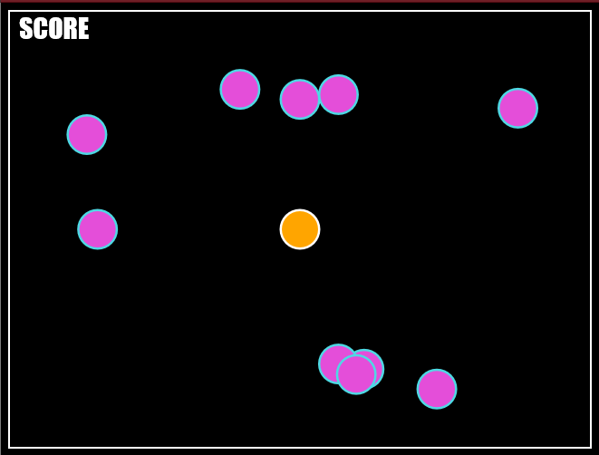

# Boomer
A small game where you control a ball and shoot balls at other balls (probably should have named it *Ball Game* instead of *Boomer*).
The game is played in the browser and can be started by simply opening **boomer.html** in your favorite browser. 



If you are using firefox it is also possible to load **manifest.json** as an addon.

## Controls
- w/a/s/d - Movement
- k - shoot and restart

## How to build
The project is written i Typescript and requires you to have it installed if you want to build the source code. Build by running `tsc` in the top directory. **tsconfig.json** should help the compiler find all source files automatically.
```
tsc
```
If this does not work for some reason, try specifying the script files manually by instead running
```
tsc popup/*.ts --outdir popup/out
```
